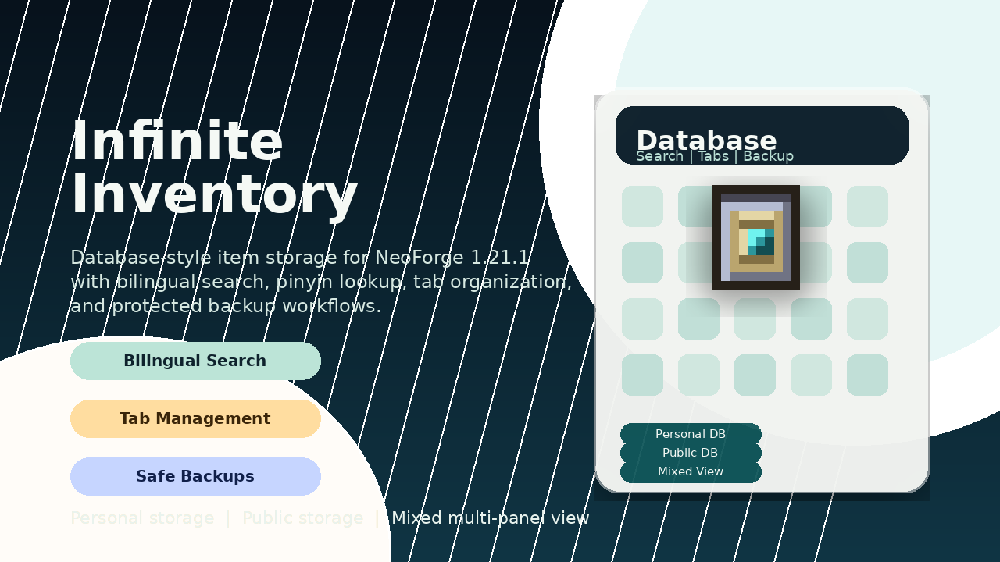

# Infinite Inventory / 无限库存



`Infinite Inventory` is a NeoForge mod for Minecraft 1.21.1 that turns item storage into a personal database-style workflow with full-screen search, tab organization, fast extraction, and optional public storage.

`无限库存` 是一个面向 Minecraft 1.21.1 NeoForge 的模组。它把传统背包管理升级为数据库式库存系统，提供全屏检索、分类页签、快速提取，以及可选的公共库存储作用域。

## Highlights / 核心特性

- Full-screen database UI with personal storage, public storage, and mixed multi-panel views.
- Bilingual search that understands Chinese item names, English aliases, item IDs, namespaces, and pinyin.
- Custom tab management with rename, icon pick, reorder, full-tab transfer, and delete-with-migration flow.
- Stable sorting by recent changes, recently added, name, count, namespace, and item ID.
- Data safety features including unresolved-item preservation, rolling backups, manual backups, and restore commands.
- Optional `Accessories` integration: wearable database terminal, compatible layout, and quick open support.

## Compatibility / 兼容性

- Minecraft: `1.21.1`
- Loader: `NeoForge`
- Supported NeoForge range: `21.1.222+`
- Java: `21`
- Optional dependency: `Accessories 1.1.0-beta.53+1.21.1`

## Installation / 安装方式

1. Install Minecraft `1.21.1`.
2. Install a compatible NeoForge build in the supported `21.1.x` range.
3. Drop the released `Infinite Inventory` JAR into the `mods/` directory.
4. Install `Accessories` only if you want wearable access from the back slot and the extra panel integration.

## Crafting / 合成获取

The database terminal is craftable in survival:

```text
D E D
R C R
D G D
```

- `D`: Diamond Block
- `E`: Ender Pearl
- `R`: Redstone Block
- `C`: Chest
- `G`: Gold Block

The item ID is `infiniteinventory:database_access_item`.

## Gameplay Flow / 玩法流程

- Open the database terminal to access the full-screen inventory database.
- Switch between personal storage, public storage, or mixed views from the top toolbar.
- Search by display name, item ID, namespace, English alias, Chinese alias, or pinyin initials/full spellings.
- Use tabs to organize categories, move batches of items, and keep storage readable at scale.
- Extract individual items, half stacks, full stacks, or custom amounts directly back to the player inventory.
- Enable the optional auto-store enhancement to send picked-up items into a chosen target tab automatically.

## Search & Sorting / 搜索与排序

- Search supports bilingual item names from `zh_cn` and `en_us`.
- Chinese names also generate pinyin full spellings and initials for fast keyboard lookup.
- Advanced search weights let you rebalance display name, item ID, namespace, pinyin, and count boost.
- Non-empty searches keep result ranking stable by combining exact, prefix, contains, fuzzy, and sort-based ordering.

## Data Safety / 数据安全

- The real database is stored in overworld `SavedData`, not on the access item itself.
- Missing items or temporarily unavailable mods are preserved as unresolved entries instead of being dropped.
- Automatic rolling backups protect dirty database state every 15 minutes.
- Manual backup and restore commands are available for operators.

Reference docs:

- [Architecture](./docs/long-term/architecture/personal-database-architecture.md)
- [Safety & Recovery](./docs/long-term/operations/database-safety-and-recovery.md)
- [Public Release Checklist](./docs/long-term/operations/public-release-checklist.md)

## Commands / 命令

- `/infiniteinventory database backup now`
- `/infiniteinventory database backup list`
- `/infiniteinventory database restore <snapshot>`

## Releases / 发布

- GitHub source and releases:
  <https://github.com/agguy/minecraft-infinite-inventory-mod-neoforge>
- Planned public distribution targets:
  `Modrinth` and `CurseForge`
- Platform-specific publishing notes and metadata checklist:
  [docs/long-term/operations/public-release-checklist.md](./docs/long-term/operations/public-release-checklist.md)

## License / 许可证

- Project license: [Apache-2.0](./LICENSE)
- Third-party attributions: [THIRD_PARTY_NOTICES.md](./THIRD_PARTY_NOTICES.md)
